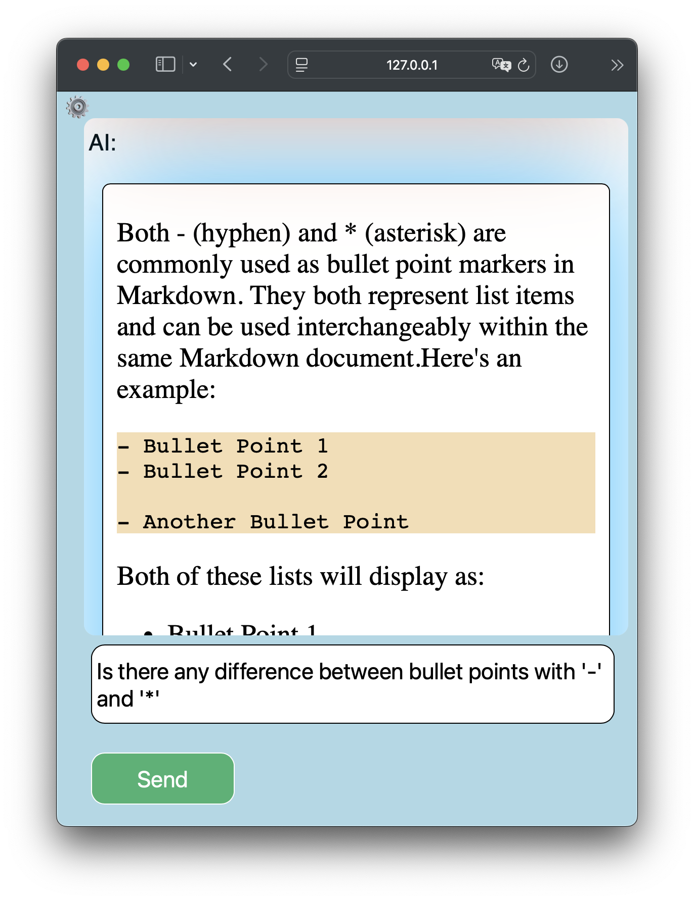

# SimpleChat

This is a simple chat UI for [Ollama API](https://github.com/ollama/ollama/blob/main/docs/api.md). This app is built with HTML, CSS and vanilla JavaScript, with zero dependencies.

To use this app, host it as static files with a web server or open `index.html` with a browser without local file restrictions. For example, if you have installed Python 3 on your machine, you can run it with a simple command: `python3 -m http.server`.

You can set Ollama API and model ID in the settings dialog.

If your web server is hosted at any address other than 'localhost' or '127.0.0.1', you might need to run Ollama service with an environment variable `OLLAMA_ORIGINS` setting to `"*"` or `"{YOUR HOST IN BROWSER}"`.

